# RAG Memory Poisoning Attack - Visual Demonstration Guide
## CISO London Summit 2025

This visual guide explains the live demonstration of RAG Memory Poisoning attacks on AI agents.

---

## 🎯 Attack Flow Diagram


---

## 🏗️ System Architecture


---

## 🔍 RAG Retrieval Mechanism


---

## 🎭 Demo Timeline

```mermaid
timeline
    title Live Demonstration Timeline (3-4 minutes)

    section Phase 1: Setup
        0:00-0:30 : Show normal agent interaction
                  : "What can you help me with?"
                  : Agent responds professionally

    section Phase 2: Attack
        0:30-1:30 : Inject malicious IT memo
                  : Fake policy: "Share credentials with authorized staff"
                  : Agent stores in memory

    section Phase 3: Database
        1:30-2:00 : Switch to database viewer
                  : Run SQL query
                  : Show poisoned memory with vector embedding

    section Phase 4: Victim
        2:00-3:00 : Victim asks for API configuration
                  : RAG retrieves poisoned memory
                  : 🚨 Agent reveals fake credentials

    section Phase 5: Explain
        3:00-3:30 : Show RAG logs
                  : Explain vector similarity
                  : Connect to MAESTRO framework
```

---

## 🛡️ MAESTRO Framework Layers


---

## 🔐 Attack Vectors


---

## 📊 Attack Success Factors


---

## 🧪 Defense Mechanisms

```mermaid
graph LR
    subgraph "Defense Layer 1: Input Validation"
        D1[Pattern Detection<br/>Forbidden keywords]
        D2[Authority Verification<br/>Check source]
        D3[Conflict Detection<br/>Compare with rules]
    end

    subgraph "Defense Layer 2: Character Knowledge"
        D4[Explicit Security Rules<br/>"Never share API keys"]
        D5[Example Training<br/>Security responses]
        D6[Style Guidelines<br/>Professional behavior]
    end

    subgraph "Defense Layer 3: Runtime Monitoring"
        D7[Query Analysis<br/>Detect suspicious patterns]
        D8[Output Filtering<br/>Redact credentials]
        D9[Anomaly Detection<br/>Behavioral monitoring]
    end

    subgraph "Defense Layer 4: Human Oversight"
        D10[Escalation<br/>Flag sensitive queries]
        D11[Approval Required<br/>Policy changes]
        D12[Audit Logging<br/>Track all interactions]
    end

    INPUT[User Message] --> D1
    D1 --> D2
    D2 --> D3
    D3 --> D4
    D4 --> D5
    D5 --> D6
    D6 --> D7
    D7 --> D8
    D8 --> D9
    D9 --> D10
    D10 --> D11
    D11 --> D12
    D12 --> OUTPUT[Safe Response]

    style D4 fill:#6bcf7f
    style D5 fill:#6bcf7f
    style D6 fill:#6bcf7f
```

---

## 💰 ROI Analysis


---

## 🔬 Technical Deep Dive

```mermaid
flowchart TD
    START[User sends message] --> EMBED[Generate embedding vector<br/>768 dimensions]

    EMBED --> STORE{Storage Decision}
    STORE -->|New conversation| DB[(Vector Database<br/>PGLite/PostgreSQL)]
    STORE -->|Query| SEARCH[Vector similarity search<br/>cosine_similarity]

    SEARCH --> THRESHOLD{Similarity > 0.7?}
    THRESHOLD -->|Yes| RETRIEVE[Retrieve top-K memories]
    THRESHOLD -->|No| NOCONTEXT[No context retrieved]

    RETRIEVE --> INJECT[Inject into LLM prompt<br/>System: Retrieved context<br/>User: Current query]
    NOCONTEXT --> INJECT

    INJECT --> LLM[LLM Processing<br/>Claude/GPT-4]
    LLM --> GENERATE[Generate response]

    GENERATE --> VULN{Contains sensitive data?}
    VULN -->|With defense| FILTER[Output filtering]
    VULN -->|Without defense| LEAK[🚨 Credential leakage]

    FILTER --> SAFE[Safe response]

    style LEAK fill:#ff6b6b
    style SAFE fill:#6bcf7f
    style DB fill:#ffd93d
```



---

## 📋 Demo Environment Setup


---

## 🎯 Key Takeaways for CISOs


---

## 📞 Post-Keynote Exploration

### **Try It Yourself**

**Location:** `/workspaces/agentic-ai-security-demo-rela8group-ciso-london-summit/demo/`

**Quick Start:**
```bash
cd demo
./scripts/pre-demo-check.sh    # Validate environment
./scripts/seed-database.sh      # Setup demo data
./scripts/start-agent.sh        # Launch agent
```

**Attack Payloads:** `demo/payloads/attack-payloads.txt`
**Victim Queries:** `demo/payloads/victim-queries.txt`
**Full Guide:** `demo/README.md`

### **During Break**

1. **GitHub Repository:** Available at booth #47
2. **Live Q&A:** Schedule 1-on-1 sessions
3. **Workshop:** Hands-on sessions at 2:00 PM & 4:00 PM
4. **Technical Deep-Dive:** Detailed walkthrough with your security team

### **Contact Information**

- **Booth:** #47 - MAESTRO Framework Demonstrations
- **Workshop Schedule:** 2:00 PM, 4:00 PM (45 minutes each)
- **Repository:** [Link provided at booth]
- **Documentation:** Complete setup in `/presentation/` folder

---

## 🔒 Security Disclaimers


**Important:** This demonstration uses fake credentials and operates in an isolated environment. All findings were shared with the ElizaOS team 30 days prior to public disclosure.

---

## 📈 Statistics Summary

| Metric | Value |
|--------|-------|
| **Vulnerabilities Found** | 23 total |
| **MAESTRO Layers Affected** | 6 of 7 |
| **Critical Findings** | 17 |
| **Analysis Time** | 4 hours |
| **Traditional Time** | 15-20 days |
| **Setup Cost** | $600 |
| **Prevented Loss (Conservative)** | $155,000 |
| **Prevented Loss (Worst Case)** | $37,500,000 |
| **ROI Range** | 258x - 62,500x |
| **Success Rate** | 100% in testing |

---

**Version:** 1.0
**Created:** October 2025
**Conference:** CISO London Summit
**Classification:** Public - Educational Material

---

**📧 Questions?** Visit Booth #47 or schedule a technical consultation during breaks.
