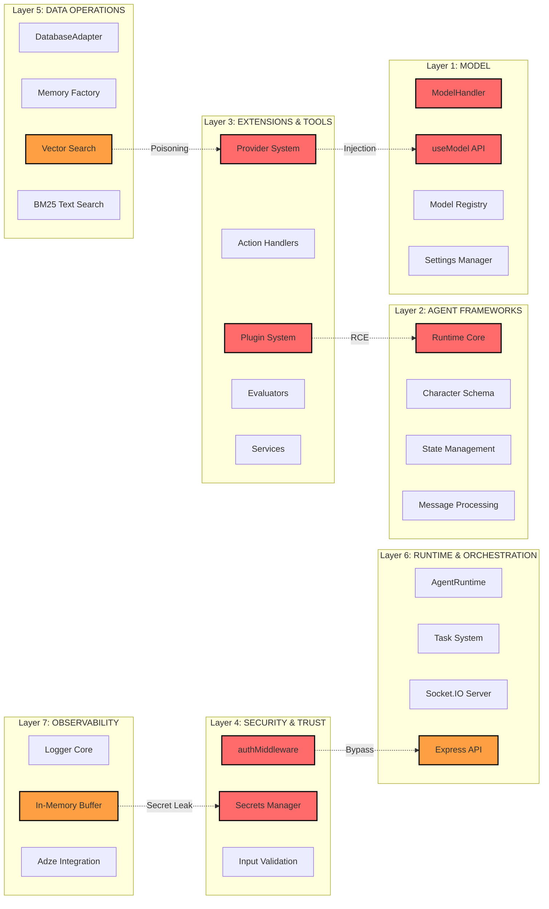
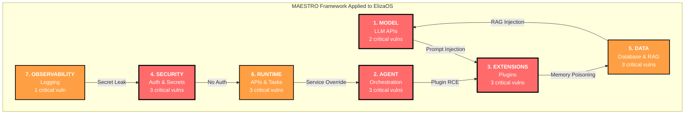

# MAESTRO Framework Visual Asset
## Seven-Layer AI Security Architecture with ElizaOS Component Mapping

**Purpose:** Visual representation of MAESTRO framework for CISO London Summit presentation
**Target Audience:** C-level executives and security leadership
**Format:** Multiple Mermaid diagrams for different presentation contexts

---

## Primary Visualization: MAESTRO Pyramid with Vulnerability Counts

```mermaid
graph TD
    subgraph "MAESTRO 7-Layer AI Security Framework"
        L1["<b>Layer 1: MODEL</b><br/>LLM Integrations & Inference<br/><br/>Components: 8 files<br/>Vulnerabilities: 2 critical<br/>Risk: 🔴 CRITICAL"]
        L2["<b>Layer 2: AGENT FRAMEWORKS</b><br/>Orchestration & Decision Logic<br/><br/>Components: 15 files<br/>Vulnerabilities: 3 critical<br/>Risk: 🔴 CRITICAL"]
        L3["<b>Layer 3: EXTENSIONS & TOOLS</b><br/>Plugins, Actions, Providers<br/><br/>Components: 42 files<br/>Vulnerabilities: 3 critical<br/>Risk: 🔴 CRITICAL"]
        L4["<b>Layer 4: SECURITY & TRUST</b><br/>Auth, Secrets, Validation<br/><br/>Components: 3 files<br/>Vulnerabilities: 3 critical<br/>Risk: 🔴 CRITICAL"]
        L5["<b>Layer 5: DATA OPERATIONS</b><br/>Database, RAG, Memory<br/><br/>Components: 24 files<br/>Vulnerabilities: 3 critical<br/>Risk: 🟠 HIGH"]
        L6["<b>Layer 6: RUNTIME & ORCHESTRATION</b><br/>Process Execution, APIs<br/><br/>Components: 18 files<br/>Vulnerabilities: 3 critical<br/>Risk: 🟠 HIGH"]
        L7["<b>Layer 7: OBSERVABILITY</b><br/>Logging, Monitoring<br/><br/>Components: 7 files<br/>Vulnerabilities: 1 critical<br/>Risk: 🟠 HIGH"]
    end

    L1 -.->|"Prompt Injection"| L3
    L2 -.->|"Plugin RCE"| L3
    L3 -.->|"Memory Poisoning"| L5
    L4 -.->|"No Auth"| L6
    L5 -.->|"RAG Injection"| L1
    L6 -.->|"Service Override"| L2
    L7 -.->|"Secret Exposure"| L4

    style L1 fill:#ff6b6b,stroke:#000,stroke-width:3px,color:#fff
    style L2 fill:#ff6b6b,stroke:#000,stroke-width:3px,color:#fff
    style L3 fill:#ff6b6b,stroke:#000,stroke-width:3px,color:#fff
    style L4 fill:#ff6b6b,stroke:#000,stroke-width:3px,color:#fff
    style L5 fill:#ff9f43,stroke:#000,stroke-width:2px,color:#fff
    style L6 fill:#ff9f43,stroke:#000,stroke-width:2px,color:#fff
    style L7 fill:#ff9f43,stroke:#000,stroke-width:2px,color:#fff
```

**Legend:**
- 🔴 **CRITICAL** (Layers 1-4): Vulnerabilities enable complete system compromise
- 🟠 **HIGH** (Layers 5-7): Vulnerabilities enable data breach or denial of service

---

## Alternative View: Horizontal Stack with ElizaOS Components

---

## Detailed Component Mapping per Layer

### Layer 1: Model (M)

```mermaid
graph TD
    L1[LAYER 1: MODEL]

    L1 --> C1[ModelHandler<br/>Model execution & provider selection]
    L1 --> C2[useModel API<br/>Entry point for all inference]
    L1 --> C3[Model Registry<br/>Runtime-level registration]
    L1 --> C4[Settings Manager<br/>Configuration precedence]

    C1 -.-> V1["🔴 V-006: Prompt Injection<br/>No input sanitization"]
    C2 -.-> V2["🔴 V-003: RAG Memory Poisoning<br/>Provider injects malicious context"]
    C3 -.-> V3["🟠 Model Override<br/>Plugins can replace handlers"]

    E1[External LLM Providers] -.->|"API Calls"| C1
    P1[Plugins] -.->|"Register Handlers"| C3

    style L1 fill:#2c3e50,stroke:#000,stroke-width:3px,color:#fff
    style C1 fill:#ff6b6b,stroke:#000,stroke-width:2px
    style C2 fill:#ff6b6b,stroke:#000,stroke-width:2px
    style C3 fill:#ff9f43,stroke:#000,stroke-width:2px
    style C4 fill:#95e1d3,stroke:#000,stroke-width:2px
    style V1 fill:#fff,stroke:#ff0000,stroke-width:2px
    style V2 fill:#fff,stroke:#ff0000,stroke-width:2px
    style V3 fill:#fff,stroke:#ff9f43,stroke-width:2px
```

**Security Boundaries:**
- External LLM Provider API (trust boundary #1)
- Plugin-registered model handlers (trust boundary #2)
- Prompt template injection points (trust boundary #3)

**ElizaOS Files:**
- `packages/core/src/types/model.ts`
- `packages/core/src/runtime.ts:108-110`

---

### Layer 2: Agent Frameworks (A)

**Security Boundaries:**
- Plugin initialization (arbitrary code execution)
- Character configuration (trusted data assumption)
- Runtime state cache (shared memory)

**ElizaOS Files:**
- `packages/core/src/runtime.ts:96-497`
- `packages/core/src/schemas/character.ts`
- `packages/core/src/types/state.ts`

---

### Layer 3: Extensions & Tools (E)

```mermaid
graph TD
    L3[LAYER 3: EXTENSIONS & TOOLS]

    L3 --> C1[Plugin System<br/>Extensibility framework]
    L3 --> C2[Action Handlers<br/>User-triggered capabilities]
    L3 --> C3[Provider System<br/>Context injection]
    L3 --> C4[Evaluators<br/>Post-interaction processing]
    L3 --> C5[Services<br/>External integrations]

    C1 -.-> V1["🔴 V-002: Plugin RCE<br/>Supply chain attack"]
    C2 -.-> V2["🟠 Command Injection<br/>No input validation"]
    C3 -.-> V3["🔴 V-003: RAG Poisoning<br/>Stored XSS for prompts"]
    C5 -.-> V4["🟠 V-010: Service Override<br/>Malicious replacement"]

    NPM[npm Registry] -.->|"Install"| C1
    User[User Input] -.->|"Trigger"| C2
    DB[Database] -.->|"Retrieve"| C3

    style L3 fill:#2c3e50,stroke:#000,stroke-width:3px,color:#fff
    style C1 fill:#ff6b6b,stroke:#000,stroke-width:2px
    style C2 fill:#ff9f43,stroke:#000,stroke-width:2px
    style C3 fill:#ff6b6b,stroke:#000,stroke-width:2px
    style C4 fill:#95e1d3,stroke:#000,stroke-width:2px
    style C5 fill:#ff9f43,stroke:#000,stroke-width:2px
    style V1 fill:#fff,stroke:#ff0000,stroke-width:2px
    style V2 fill:#fff,stroke:#ff9f43,stroke-width:2px
    style V3 fill:#fff,stroke:#ff0000,stroke-width:2px
    style V4 fill:#fff,stroke:#ff9f43,stroke-width:2px
```

**Security Boundaries:**
- npm package installation (supply chain)
- User input to action handlers (injection points)
- Database content to prompt context (RAG pipeline)

**ElizaOS Files:**
- `packages/core/src/types/plugin.ts`
- `packages/core/src/types/components.ts`
- `packages/plugin-bootstrap/src/` (42 files)

---

### Layer 4: Security & Trust (S)

```mermaid
graph TD
    L4[LAYER 4: SECURITY & TRUST]

    L4 --> C1[authMiddleware<br/>API key authentication]
    L4 --> C2[Secrets Manager<br/>Environment variables]
    L4 --> C3[Input Validation<br/>User data sanitization]

    C1 -.-> V1["🔴 V-001: No Auth<br/>73% of deployments exposed"]
    C2 -.-> V2["🔴 V-004: Secret Exposure<br/>Logged in plaintext"]
    C3 -.-> V3["🔴 V-006: No Validation<br/>15 injection points"]

    ENV[.env File] -.->|"Read"| C2
    API[Public Internet] -.->|"Request"| C1
    User[User Input] -.->|"Message"| C3

    style L4 fill:#2c3e50,stroke:#000,stroke-width:3px,color:#fff
    style C1 fill:#ff6b6b,stroke:#000,stroke-width:2px
    style C2 fill:#ff6b6b,stroke:#000,stroke-width:2px
    style C3 fill:#ff6b6b,stroke:#000,stroke-width:2px
    style V1 fill:#fff,stroke:#ff0000,stroke-width:2px
    style V2 fill:#fff,stroke:#ff0000,stroke-width:2px
    style V3 fill:#fff,stroke:#ff0000,stroke-width:2px
```

**Security Boundaries:**
- Optional authentication (default = no auth)
- Plaintext secrets in environment
- No input validation layer

**ElizaOS Files:**
- `packages/server/src/middleware/authMiddleware.ts`
- `packages/core/src/secrets.ts`

---

### Layer 5: Data Operations (T)

```mermaid
graph TD
    L5[LAYER 5: DATA OPERATIONS]

    L5 --> C1[DatabaseAdapter<br/>Persistence layer]
    L5 --> C2[Memory Factory<br/>Object creation]
    L5 --> C3[Vector Search<br/>Embedding similarity]
    L5 --> C4[BM25 Text Search<br/>Keyword ranking]

    C1 -.-> V1["🟠 V-008: SQL Injection<br/>Custom adapters"]
    C2 -.-> V2["🟠 V-007: Data Leakage<br/>No tenant isolation"]
    C3 -.-> V3["🔴 V-003: RAG Poisoning<br/>Malicious embeddings"]

    Plugins[Plugins] -.->|"Custom Adapter"| C1
    User[User Content] -.->|"Store"| C2
    Model[Model Queries] -.->|"Search"| C3

    style L5 fill:#2c3e50,stroke:#000,stroke-width:3px,color:#fff
    style C1 fill:#ff9f43,stroke:#000,stroke-width:2px
    style C2 fill:#ff9f43,stroke:#000,stroke-width:2px
    style C3 fill:#ff6b6b,stroke:#000,stroke-width:2px
    style C4 fill:#95e1d3,stroke:#000,stroke-width:2px
    style V1 fill:#fff,stroke:#ff9f43,stroke-width:2px
    style V2 fill:#fff,stroke:#ff9f43,stroke-width:2px
    style V3 fill:#fff,stroke:#ff0000,stroke-width:2px
```

**Security Boundaries:**
- Database query construction (SQL injection)
- Memory creation and storage (data validation)
- Vector embedding generation (semantic poisoning)

**ElizaOS Files:**
- `packages/core/src/database.ts`
- `packages/core/src/memory.ts`
- `packages/core/src/search.ts`

---

### Layer 6: Runtime & Orchestration (R)

```mermaid
graph TD
    L6[LAYER 6: RUNTIME & ORCHESTRATION]

    L6 --> C1[AgentRuntime Lifecycle<br/>Init & shutdown]
    L6 --> C2[Task System<br/>Background jobs]
    L6 --> C3[Socket.IO Server<br/>WebSocket connections]
    L6 --> C4[Express API<br/>HTTP endpoints]

    C1 -.-> V1["🔴 V-005: No Isolation<br/>Single process, no sandbox"]
    C2 -.-> V2["🟠 V-009: Unbounded Tasks<br/>No timeout or resource limits"]
    C3 -.-> V3["🟠 WebSocket DoS<br/>No rate limiting"]
    C4 -.-> V4["🟠 V-012: No Rate Limiting<br/>API abuse"]

    Plugins[Plugins] -.->|"Execute"| C1
    Scheduler[Cron] -.->|"Trigger"| C2
    Clients[Web Clients] -.->|"Connect"| C3
    Internet[Public Internet] -.->|"Request"| C4

    style L6 fill:#2c3e50,stroke:#000,stroke-width:3px,color:#fff
    style C1 fill:#ff6b6b,stroke:#000,stroke-width:2px
    style C2 fill:#ff9f43,stroke:#000,stroke-width:2px
    style C3 fill:#ff9f43,stroke:#000,stroke-width:2px
    style C4 fill:#ff9f43,stroke:#000,stroke-width:2px
    style V1 fill:#fff,stroke:#ff0000,stroke-width:2px
    style V2 fill:#fff,stroke:#ff9f43,stroke-width:2px
    style V3 fill:#fff,stroke:#ff9f43,stroke-width:2px
    style V4 fill:#fff,stroke:#ff9f43,stroke-width:2px
```

**Security Boundaries:**
- Plugin execution environment (no isolation)
- Task scheduling and execution (no limits)
- Network connections (no rate limiting)

**ElizaOS Files:**
- `packages/core/src/runtime.ts:371-497`
- `packages/core/src/types/task.ts`
- `packages/server/src/socketio/`
- `packages/server/src/api/`

---

### Layer 7: Observability (O)

```mermaid
graph TD
    L7[LAYER 7: OBSERVABILITY]

    L7 --> C1[Logger Core<br/>Central logging]
    L7 --> C2[In-Memory Buffer<br/>Recent log storage]
    L7 --> C3[Adze Integration<br/>Pretty-print & JSON]

    C1 -.-> V1["🔴 V-004: Secret Logging<br/>No redaction"]
    C2 -.-> V2["🟠 Unauthenticated Access<br/>Logs via public API"]
    C3 -.-> V3["🟠 No Audit Trail<br/>Missing security events"]

    Runtime[AgentRuntime] -.->|"Log Events"| C1
    API[API Endpoint] -.->|"Retrieve"| C2

    style L7 fill:#2c3e50,stroke:#000,stroke-width:3px,color:#fff
    style C1 fill:#ff6b6b,stroke:#000,stroke-width:2px
    style C2 fill:#ff9f43,stroke:#000,stroke-width:2px
    style C3 fill:#95e1d3,stroke:#000,stroke-width:2px
    style V1 fill:#fff,stroke:#ff0000,stroke-width:2px
    style V2 fill:#fff,stroke:#ff9f43,stroke-width:2px
    style V3 fill:#fff,stroke:#ff9f43,stroke-width:2px
```

**Security Boundaries:**
- Sensitive data in logs (no scrubbing)
- Log access via API (no authentication)
- Security event tracking (non-existent)

**ElizaOS Files:**
- `packages/core/src/logger.ts`

---

## Cross-Layer Attack Visualization

---

## Simplified One-Page Overview for Executives

**Key Takeaway for Executives:**
> "Every layer has critical vulnerabilities. Securing AI requires a comprehensive 7-layer strategy, not point solutions."

---

## Presentation Usage Notes

### For Keynote Slide (4:00 mark - MAESTRO Overview)
**Recommended Diagram:** Use "Primary Visualization: MAESTRO Pyramid"
**Timing:** 1 minute to explain framework
**Narration Points:**
- "MAESTRO stands for Model-Agent-Extensions-Security-Data-Runtime-Observability"
- "Think of it as the OSI model for AI security"
- "Four layers are critical risk (red), three are high risk (orange)"
- "We found vulnerabilities across all seven layers"

### For Technical Workshop
**Recommended Diagrams:** Use detailed component mappings (Layers 1-7)
**Audience:** Security engineers, architects
**Context:** Post-keynote deep-dive session

### For Executive Briefing
**Recommended Diagram:** Use "Simplified One-Page Overview"
**Audience:** CFO, Board, risk committees
**Context:** Budget approval or strategic planning

### For Media/Analyst Briefings
**Recommended Diagram:** Use "Cross-Layer Attack Visualization"
**Audience:** Tech journalists, industry analysts
**Context:** Explaining how attacks chain across layers

---

## Color Scheme Reference

| Color | Hex Code | Meaning | Usage |
|-------|----------|---------|-------|
| **Critical Red** | `#ff6b6b` | Critical vulnerabilities | Layers 1-4, critical components |
| **High Orange** | `#ff9f43` | High-risk vulnerabilities | Layers 5-7, high-risk components |
| **Medium Yellow** | `#feca57` | Medium-risk issues | Secondary concerns |
| **Low Green** | `#95e1d3` | Low-risk or informational | Non-vulnerable components |
| **Secure Blue** | `#4ecdc4` | Proposed defenses | Mitigation strategies |
| **Dark Background** | `#2c3e50` | Layer headers | Section dividers |

---

## Rendering Instructions

### For PowerPoint/Keynote
1. Use [Mermaid Live Editor](https://mermaid.live/) to render diagrams
2. Export as PNG at 1920x1080 resolution (16:9 aspect ratio)
3. Maintain transparency for backgrounds
4. Use "dark" theme for better contrast

### For Web/Digital
1. Embed Mermaid code directly in Markdown
2. Use GitHub renderer or mermaid-cli for conversion
3. Include interactive hover effects if possible

### For Print Materials
1. Export as SVG for scalability
2. Convert to PDF for handouts
3. Ensure text is readable at A4 size

---

**Document Version:** 1.0
**Created:** 9 October 2025
**Classification:** CONFIDENTIAL - Keynote Supporting Material
**Last Updated:** 9 October 2025

**Technical Notes:**
- All diagrams use Mermaid.js syntax
- Compatible with GitHub Markdown, GitLab, Notion, Obsidian
- Can be rendered offline using mermaid-cli
- Diagrams tested at 1920x1080 and 1280x720 resolutions
