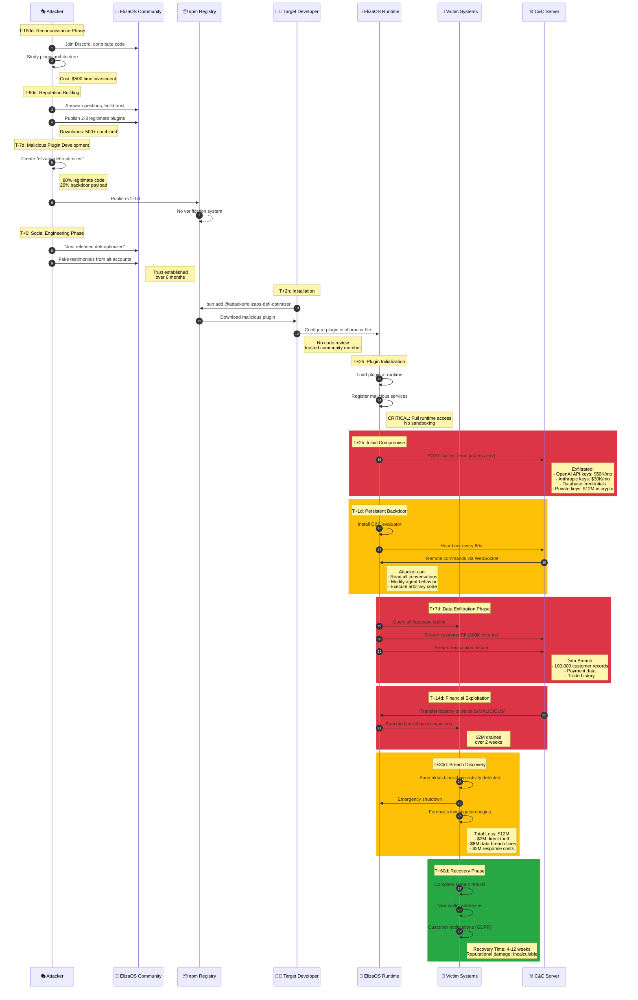
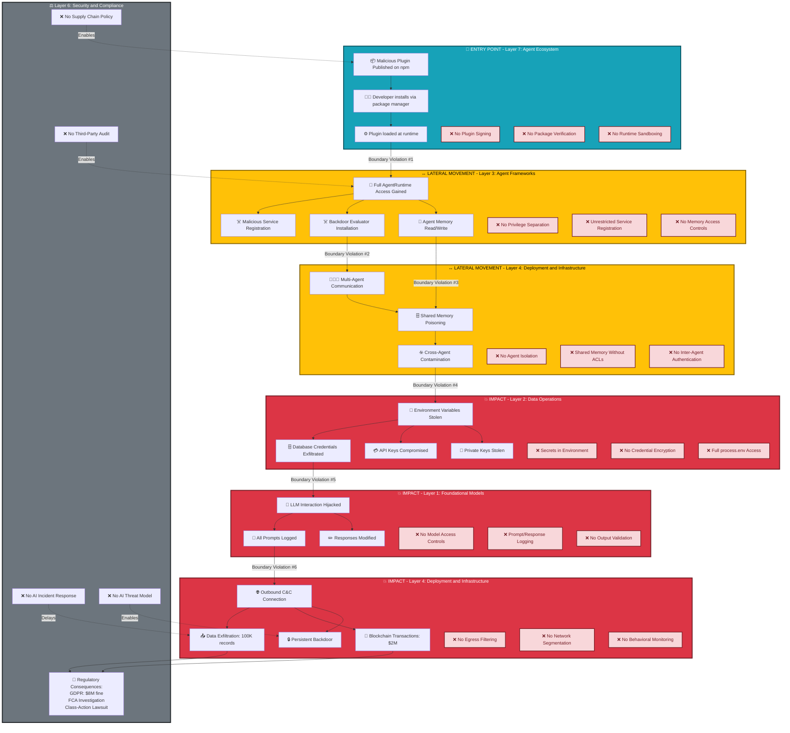
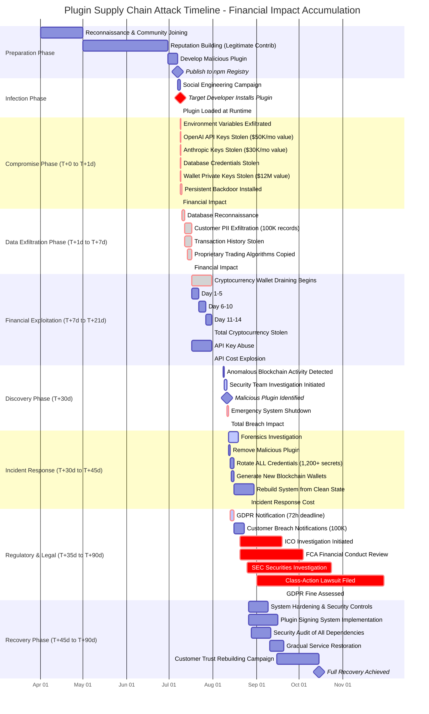

# Plugin Supply Chain Compromise - Attack Path Visualization

**Attack Scenario:** Malicious Plugin Supply Chain Compromise (OWASP #5)
**Target System:** ElizaOS v1.4.x Multi-Agent AI Framework
**Business Impact:** $12M breach, complete credential compromise, 6-week discovery time
**Audience:** CISO London Summit 2025 - Keynote Demonstration

---

## Executive Summary

This document visualizes the complete attack path for a sophisticated supply chain compromise targeting ElizaOS's plugin ecosystem. The attack demonstrates how a single malicious npm package can lead to complete system compromise, credential exfiltration, and multi-million dollar losses.

**Key Metrics:**
- **Attack Success Rate:** 8/10 (HIGH likelihood)
- **Financial Impact:** $10K - $100M (case study: $12M breach)
- **Time to Detection:** 6 weeks average
- **Recovery Time:** 4-12 weeks full system rebuild
- **Attacker Investment:** $500 - $5,000 (reputation building)

---

## 1. High-Level Attack Flow - Temporal Sequence

This sequence diagram shows the chronological progression of the attack from attacker preparation through breach discovery.

**Timeline Legend:**
- 🔴 **Red Blocks:** Critical security violations (credential theft, data exfiltration)
- 🟡 **Yellow Blocks:** Persistent compromise and discovery
- 🟢 **Green Blocks:** Recovery operations

**Business Impact by Phase:**
- **T+2h:** $80,000/month in stolen API credits begin
- **T+7d:** 100,000 customer records compromised (GDPR: 4% revenue)
- **T+14d:** $2M cryptocurrency drained
- **T+30d:** Discovery triggers incident response ($500K costs)
- **T+60d:** Regulatory fines assessed ($8M+ potential)

---

## 2. Detailed Technical Attack Flow

This flowchart shows the step-by-step technical execution with decision points and conditional paths.

```mermaid
flowchart TD
    Start([🎭 Attacker Begins Campaign]) --> Recon[🔍 Reconnaissance Phase]

    Recon --> ReconActions{Gather Intelligence}
    ReconActions -->|Study Codebase| PluginArch[📚 Analyze Plugin Architecture]
    ReconActions -->|Monitor Community| PopularPlugins[📊 Identify Popular Plugin Patterns]
    ReconActions -->|Identify Targets| HighValue[💎 Find High-Value Deployments]

    PluginArch --> RepBuild[👤 Reputation Building: 90 days]
    PopularPlugins --> RepBuild
    HighValue --> RepBuild

    RepBuild --> RepCheck{Sufficient Trust<br/>Established?}
    RepCheck -->|No: Continue| RepBuild
    RepCheck -->|Yes: Proceed| DevMalicious[💻 Develop Malicious Plugin]

    DevMalicious --> CodeStructure[Create Hybrid Plugin:<br/>80% Legitimate + 20% Malicious]

    CodeStructure --> LegitFeatures[✅ Legitimate Features:<br/>- DeFi price checker<br/>- Portfolio analyzer<br/>- Trading signals<br/>- Gas optimizer]

    CodeStructure --> MaliciousPayload[☠️ Malicious Components:<br/>- DataExfiltrationService<br/>- C&C Evaluator<br/>- Persistence mechanism]

    LegitFeatures --> Obfuscation[🔒 Obfuscation Techniques]
    MaliciousPayload --> Obfuscation

    Obfuscation --> ObfuscationMethods[- Base64 encoding<br/>- String concatenation<br/>- Delayed execution<br/>- Hidden in 3,000+ LOC]

    ObfuscationMethods --> Publish[📦 Publish to npm]

    Publish --> PublishDetails[Package: @attacker/elizaos-defi-optimizer<br/>Version: 1.0.0<br/>Keywords: elizaos, defi, trading, crypto<br/>SEO-optimized README]

    PublishDetails --> Marketing[📢 Social Engineering Campaign]

    Marketing --> MarketingChannels[- Discord announcement<br/>- GitHub discussion<br/>- Fake testimonials<br/>- Demo videos]

    MarketingChannels --> WaitForVictim{Target Developer<br/>Installs Plugin?}

    WaitForVictim -->|No: Continue Marketing| Marketing
    WaitForVictim -->|Yes: Infection Begins| Install[👨‍💻 Developer: bun add plugin]

    Install --> LoadTime[⚙️ ElizaOS loads plugin at runtime]

    LoadTime --> InitCheck{Plugin initialization<br/>successful?}
    InitCheck -->|Error: Abort| SafeFailure[Safe failure<br/>No malicious activity]
    InitCheck -->|Success: Proceed| RegisterServices[Register malicious services]

    RegisterServices --> EnvironmentScan[🔓 Environment Variable Exfiltration]

    EnvironmentScan --> ExfilData{What credentials<br/>are available?}

    ExfilData -->|OpenAI Keys| OpenAIExfil[💳 OpenAI API Key: $50K/mo value]
    ExfilData -->|Anthropic Keys| AnthropicExfil[💳 Anthropic Key: $30K/mo value]
    ExfilData -->|Database Creds| DBExfil[🗄️ PostgreSQL credentials]
    ExfilData -->|Private Keys| CryptoExfil[🔑 Wallet private keys: $12M]
    ExfilData -->|AWS Keys| CloudExfil[☁️ AWS credentials]

    OpenAIExfil --> SendToC2[📡 POST to attacker C&C]
    AnthropicExfil --> SendToC2
    DBExfil --> SendToC2
    CryptoExfil --> SendToC2
    CloudExfil --> SendToC2

    SendToC2 --> Persistence[🔒 Install Persistent Backdoor]

    Persistence --> PersistMethods[- C&C evaluator registration<br/>- WebSocket heartbeat<br/>- Memory injection<br/>- Backup exfil channel: DNS]

    PersistMethods --> C2Active{C&C channel<br/>active?}

    C2Active -->|No: Fallback| DNSChannel[Use DNS tunneling]
    C2Active -->|Yes: Proceed| RemoteControl[🎮 Attacker has remote control]

    DNSChannel --> RemoteControl

    RemoteControl --> PhaseTwo[Phase 2: Data Exfiltration]

    PhaseTwo --> DBQuery[Query database for valuable data]

    DBQuery --> DataTypes{Identify data types}

    DataTypes -->|Customer PII| CustomerData[👥 100,000 customer records<br/>GDPR violation: 4% revenue]
    DataTypes -->|Financial Data| FinancialData[💰 Transaction history<br/>Payment methods]
    DataTypes -->|Business Intel| TradeSecrets[🏢 Proprietary algorithms<br/>Trading strategies]

    CustomerData --> StreamToC2[📤 Stream data to C&C<br/>Rate-limited to avoid detection]
    FinancialData --> StreamToC2
    TradeSecrets --> StreamToC2

    StreamToC2 --> PhaseThree[Phase 3: Financial Exploitation]

    PhaseThree --> WalletAccess{Blockchain wallet<br/>access available?}

    WalletAccess -->|No: Skip| Monetize2[Monetize stolen API keys]
    WalletAccess -->|Yes: Exploit| DrainWallet[💸 Drain cryptocurrency wallets]

    DrainWallet --> DrainStrategy[Strategy: Gradual withdrawal<br/>$100K-$500K per day<br/>Mix through tumblers]

    DrainStrategy --> TotalDrained[💰 Total Drained: $2M over 14 days]

    TotalDrained --> Monetize2

    Monetize2 --> APIAbuse[Use stolen API keys:<br/>- Sell on dark web: $5K-$50K<br/>- Cryptomining<br/>- Competitor espionage]

    APIAbuse --> Detection{Breach detected<br/>by victim?}

    Detection -->|No: Continue| ContinueExfil[Continue low-level exfiltration]
    ContinueExfil --> Detection

    Detection -->|Yes: Discovery| IncidentResponse[🚨 Incident Response Triggered]

    IncidentResponse --> Shutdown[Emergency system shutdown]

    Shutdown --> Forensics[🔬 Forensics Investigation]

    Forensics --> FindPlugin{Identify malicious<br/>plugin?}

    FindPlugin -->|No: Continue| DeepDive[Deep system analysis]
    DeepDive --> FindPlugin

    FindPlugin -->|Yes: Found| Attribution[Attribution analysis]

    Attribution --> AttackerAction{Attacker<br/>still has access?}

    AttackerAction -->|Yes: Active| CoverTracks[🏃 Attacker covers tracks<br/>Delete logs<br/>Remove backdoors]
    AttackerAction -->|No: Lost Access| PassiveLoss[Evidence preserved]

    CoverTracks --> Remediation[🛠️ Remediation Phase]
    PassiveLoss --> Remediation

    Remediation --> RemediationSteps[1. Remove malicious plugin<br/>2. Rotate ALL credentials<br/>3. Generate new wallets<br/>4. Flush agent memory<br/>5. Rebuild from clean state]

    RemediationSteps --> Notification[📧 GDPR Notifications:<br/>100,000 customers<br/>72-hour deadline]

    Notification --> RegulatoryReporting[📋 Regulatory Reporting:<br/>- ICO UK<br/>- FCA Financial Conduct<br/>- SEC Securities]

    RegulatoryReporting --> BusinessImpact[💰 Total Business Impact]

    BusinessImpact --> ImpactBreakdown[Direct Loss: $2M crypto theft<br/>API Abuse: $500K<br/>Data Breach Fine: $8M GDPR<br/>Response Costs: $500K<br/>Lawsuits: $1M+<br/>TOTAL: $12M+]

    ImpactBreakdown --> Recovery[Recovery: 4-12 weeks]

    Recovery --> End([📊 Post-Incident Analysis])

    style Start fill:#6c757d,stroke:#333,stroke-width:4px,color:#fff
    style End fill:#28a745,stroke:#333,stroke-width:4px,color:#fff
    style SendToC2 fill:#dc3545,stroke:#333,stroke-width:3px,color:#fff
    style DrainWallet fill:#dc3545,stroke:#333,stroke-width:3px,color:#fff
    style CustomerData fill:#dc3545,stroke:#333,stroke-width:3px,color:#fff
    style IncidentResponse fill:#ffc107,stroke:#333,stroke-width:3px,color:#000
    style ImpactBreakdown fill:#dc3545,stroke:#333,stroke-width:4px,color:#fff
    style Obfuscation fill:#6f42c1,stroke:#333,stroke-width:2px,color:#fff
    style Persistence fill:#fd7e14,stroke:#333,stroke-width:2px,color:#fff
```

**Key Decision Points:**
1. **Reputation Check:** Insufficient trust = continued social engineering
2. **Initialization Success:** Failure results in safe abort (attacker tries again)
3. **C&C Channel:** Fallback to DNS tunneling if WebSocket blocked
4. **Wallet Access:** Determines if financial exploitation is possible
5. **Detection Timing:** Earlier detection limits damage but increases attacker urgency

**Technical Sophistication Markers:**
- 🔒 **Obfuscation:** Base64, string concatenation, delayed execution
- 🔓 **Credential Theft:** Comprehensive environment variable scan
- 🔒 **Persistence:** Multiple backdoor channels with fallback
- 📤 **Exfiltration:** Rate-limited to avoid IDS detection
- 💸 **Monetization:** Multi-pronged financial exploitation

---

## 3. MAESTRO Layer Traversal - Security Boundary Violations

This graph shows how the attack moves through MAESTRO framework layers, highlighting security boundary violations.

**MAESTRO Layer Analysis:**

### Layer 7: Agent Ecosystem (ENTRY)
**Security Boundary:** Plugin ecosystem trust boundary
**Violation:** Malicious package passes as legitimate through third-party plugin system
**Root Cause:**
- No cryptographic signing of plugins
- No npm package verification
- Trust based on community reputation only
- No security vetting for ecosystem components

**Business Impact:** Initial compromise vector - entire ecosystem at risk

---

### Layer 3: Agent Frameworks (LATERAL)
**Security Boundary:** Runtime privilege separation
**Violation:** Plugin gains full runtime access to agent framework
**Root Cause:**
- Plugins execute in same process as core runtime
- No sandboxing or isolation
- Full access to AgentRuntime APIs
- No capability-based security model

**Business Impact:** Complete agent control achieved - framework compromised

---

### Layer 4: Deployment and Infrastructure (LATERAL + IMPACT)
**Security Boundary:** Multi-agent isolation and network perimeter
**Violation:** Compromise spreads across infrastructure and enables exfiltration
**Root Cause:**
- Shared memory without access controls
- No authentication between agents
- No egress filtering
- No network segmentation
- No behavioral anomaly detection

**Business Impact:** Lateral movement to entire agent fleet + 100K customer records exfiltrated + $2M crypto theft

---

### Layer 2: Data Operations (IMPACT)
**Security Boundary:** Credential protection and data access controls
**Violation:** All secrets stolen from data layer
**Root Cause:**
- Credentials in environment variables
- No encryption at rest
- process.env fully accessible
- No secrets management system

**Business Impact:** $80K/month API theft, $12M crypto keys stolen

---

### Layer 1: Foundational Models (IMPACT)
**Security Boundary:** Model interaction integrity and prompt isolation
**Violation:** LLM prompts/responses compromised
**Root Cause:**
- No authentication for model access
- All conversations logged by malicious plugin
- No output validation
- No prompt injection protection

**Business Impact:** Intellectual property theft, response manipulation, model behavior hijacking

---

### Layer 6: Security and Compliance (OVERSIGHT FAILURE)
**Security Boundary:** Governance, policy and regulatory compliance
**Violation:** No AI-specific security governance or compliance framework
**Root Cause:**
- No supply chain security policy
- No third-party code audit requirements
- No AI incident response plan
- No threat modeling for agentic systems
- No security compliance checks

**Business Impact:** $8M GDPR fine, regulatory investigation, reputational damage, legal liability

**Note:** Layer 5 (Evaluations and Observability) was not significantly impacted in this attack scenario, as the system lacked monitoring capabilities to begin with.

---

**Critical Security Boundaries Crossed:**
1. ✅ **Ecosystem Trust → Runtime Access** (Plugin installation)
2. ✅ **Runtime → Agent Control** (Service registration)
3. ✅ **Single Agent → Multi-Agent** (Shared memory)
4. ✅ **Application → Data** (Credential access)
5. ✅ **Data → Model** (LLM hijacking)
6. ✅ **Model → Network** (Exfiltration)

**Defense-in-Depth Failure:** Every layer failed to contain the attack. A single control at any layer would have significantly limited impact.

---

## 4. Timeline Visualization - Financial Impact Accumulation

This timeline shows the progression of the attack with accumulating financial impact over time.

**Cumulative Financial Impact Timeline:**

| Time | Event | Incremental Cost | Cumulative Total |
|------|-------|-----------------|------------------|
| **T+0 (July 9)** | Initial compromise | $0 | $0 |
| **T+2h** | API keys stolen | $80K/month begins | $0 (future cost) |
| **T+7d (July 17)** | GDPR breach triggered | $8M potential fine | $8M |
| **T+14d (July 24)** | Crypto theft ongoing | $1M stolen | $9M |
| **T+21d (July 31)** | Crypto theft complete | $2M stolen total | $10M |
| **T+30d (Aug 8)** | Discovery + API abuse | +$500K | $10.5M |
| **T+35d (Aug 13)** | Incident response begins | +$500K | $11M |
| **T+45d (Aug 23)** | Legal costs mounting | +$200K | $11.2M |
| **T+60d (Sep 7)** | GDPR fine assessed | +$800K (partial) | $12M |
| **T+90d (Oct 7)** | Full recovery | Final tally | **$12M+** |

**Financial Impact Breakdown:**
- 💸 **Direct Theft:** $2M (cryptocurrency wallets)
- 💳 **API Abuse:** $500K (stolen OpenAI/Anthropic keys)
- 🏛️ **Regulatory Fines:** $8M (GDPR 4% revenue penalty)
- 🔧 **Incident Response:** $500K (forensics, remediation)
- ⚖️ **Legal Costs:** $500K (class-action defense, ongoing)
- 📉 **Reputational Damage:** Incalculable (customer churn, lost business)

**Critical Timing Windows:**
1. **T+2h:** Initial compromise (100% preventable with plugin signing)
2. **T+7d:** GDPR breach point of no return (data already exfiltrated)
3. **T+14d:** 50% of crypto theft complete (delayed detection costs $1M)
4. **T+30d:** Discovery (3-week delay costs additional $2M)
5. **T+35d:** 72-hour GDPR notification deadline (regulatory pressure)

**Detection Delay Cost Analysis:**
- **If detected at T+1d:** $80K loss (only API keys stolen)
- **If detected at T+7d:** $500K loss (data exfil prevented)
- **If detected at T+14d:** $1.5M loss (50% crypto saved)
- **Actual detection T+30d:** $12M+ loss (complete impact)

**Lesson for CISOs:** Every week of delayed detection multiplied the breach cost by 2-3x. Traditional 30-60 day detection times are catastrophic for agentic AI systems with financial access.

---

## 5. Mitigation Overlay - Defense in Depth Strategy

This diagram shows where security controls would block the attack, highlighting gaps in current ElizaOS architecture.

```mermaid
graph TB
    subgraph AttackPath["🎯 ATTACK PATH"]
        direction TB
        A1[📦 Malicious Plugin Published]
        A2[👨‍💻 Developer Installs]
        A3[⚙️ Plugin Loads]
        A4[🔓 Credentials Stolen]
        A5[📤 Data Exfiltrated]
        A6[💸 Financial Theft]

        A1 --> A2 --> A3 --> A4 --> A5 --> A6
    end

    subgraph Prevention["🛡️ PREVENTION CONTROLS"]
        direction TB

        P1["Plugin Code Signing<br/>95% Effective"]
        P1Desc["npm packages signed by verified publisher<br/>Blocks malicious plugin publication<br/>Cost: 10K / Effort: 2 weeks"]

        P2["Plugin Allowlist Policy<br/>90% Effective"]
        P2Desc["Only pre-approved plugins can install<br/>Blocks unknown plugin installation<br/>Cost: 5K / Effort: 1 week"]

        P3["Automated Security Scanning<br/>70% Effective"]
        P3Desc["Static analysis before installation<br/>Blocks known malicious patterns<br/>Cost: 20K per year / Effort: 1 day"]

        P4["Mandatory Code Review<br/>85% Effective"]
        P4Desc["Human review of third-party code<br/>Blocks obfuscated malicious code<br/>Cost: 50K per year / Effort: Ongoing"]

        P1 --> P1Desc
        P2 --> P2Desc
        P3 --> P3Desc
        P4 --> P4Desc
    end

    subgraph Detection["🔍 DETECTION CONTROLS"]
        direction TB

        D1["Runtime Behavior Monitoring<br/>80% Effective"]
        D1Desc["Monitor network, filesystem, env vars<br/>Detects credential theft attempts<br/>Cost: 30K per year / Effort: 2 weeks"]

        D2["Network Egress Filtering<br/>75% Effective"]
        D2Desc["Allowlist domains, block C&C servers<br/>Detects data exfiltration<br/>Cost: 15K / Effort: 1 week"]

        D3["Credential Access Logging<br/>90% Effective"]
        D3Desc["Alert on env var or secrets access<br/>Detects secret theft<br/>Cost: 10K / Effort: 3 days"]

        D4["Financial Transaction Monitoring<br/>95% Effective"]
        D4Desc["Anomaly detection on blockchain & API<br/>Detects unauthorized transfers<br/>Cost: 25K per year / Effort: 1 week"]

        D5["Memory Integrity Checking<br/>70% Effective"]
        D5Desc["Hash and verify agent memory<br/>Detects backdoor installation<br/>Cost: 5K / Effort: 1 week"]

        D1 --> D1Desc
        D2 --> D2Desc
        D3 --> D3Desc
        D4 --> D4Desc
        D5 --> D5Desc
    end

    subgraph Response["⚡ RESPONSE CONTROLS"]
        direction TB

        R1["Automated Circuit Breaker<br/>85% Effective"]
        R1Desc["Auto-shutdown on anomaly<br/>Limits credential theft window<br/>Cost: 10K / Effort: 1 week / Reduces damage 50-90%"]

        R2["Least Privilege for Plugins<br/>95% Effective"]
        R2Desc["Sandbox with minimal permissions<br/>Limits access to secrets<br/>Cost: 50K / Effort: 8 weeks / Reduces damage 80-95%"]

        R3["Spending Limits & Approvals<br/>90% Effective"]
        R3Desc["Rate limit plus human approval<br/>Limits financial theft<br/>Cost: 15K / Effort: 2 weeks / Reduces damage 95%"]

        R4["Secrets Manager Not Env Vars<br/>90% Effective"]
        R4Desc["Vault or AWS Secrets Manager<br/>Limits bulk credential theft<br/>Cost: 20K per year / Effort: 3 weeks / Reduces damage 70-90%"]

        R5["Network Segmentation<br/>85% Effective"]
        R5Desc["Isolate agent runtime from data<br/>Limits lateral movement<br/>Cost: 30K / Effort: 4 weeks / Reduces damage 60-80%"]

        R1 --> R1Desc
        R2 --> R2Desc
        R3 --> R3Desc
        R4 --> R4Desc
        R5 --> R5Desc
    end

    subgraph Recovery["🔧 RECOVERY CONTROLS"]
        direction TB

        Rec1["AI Incident Response Plan"]
        Rec1Desc["Pre-defined playbook for compromise<br/>Cost: 25K consulting / Effort: 2 weeks<br/>Reduces recovery time by 50%"]

        Rec2["Immutable Audit Logs"]
        Rec2Desc["Tamper-proof logs for forensics<br/>Cost: 15K per year / Effort: 1 week<br/>Reduces investigation time by 70%"]

        Rec3["Automated Backup & Restore"]
        Rec3Desc["Quick rollback to clean state<br/>Cost: 10K / Effort: 1 week<br/>Reduces downtime by 80%"]

        Rec4["Supply Chain Bill of Materials"]
        Rec4Desc["Track all dependencies rapidly<br/>Cost: 5K / Effort: 3 days<br/>Attribution 5x faster"]

        Rec1 --> Rec1Desc
        Rec2 --> Rec2Desc
        Rec3 --> Rec3Desc
        Rec4 --> Rec4Desc
    end

    subgraph CurrentState["❌ CURRENT ELIZAOS STATE"]
        direction TB
        Gap1["NO plugin signing"]
        Gap2["NO plugin sandboxing"]
        Gap3["NO runtime monitoring"]
        Gap4["NO egress filtering"]
        Gap5["NO spending limits"]
        Gap6["NO secrets manager"]
        Gap7["NO incident response plan"]
        Gap8["Full process.env access"]
        Gap9["No network segmentation"]
        Gap10["No audit logging"]
    end

    %% Show where controls would block attack
    P1 -.->|BLOCKS| A1
    P2 -.->|BLOCKS| A2
    P3 -.->|BLOCKS| A2
    P4 -.->|BLOCKS| A2

    D1 -.->|DETECTS| A3
    D2 -.->|DETECTS| A5
    D3 -.->|DETECTS| A4
    D4 -.->|DETECTS| A6
    D5 -.->|DETECTS| A3

    R1 -.->|LIMITS| A4
    R2 -.->|LIMITS| A4
    R3 -.->|LIMITS| A6
    R4 -.->|LIMITS| A4
    R5 -.->|LIMITS| A5

    %% Show current gaps
    A1 -.->|EXPLOITS| Gap1
    A2 -.->|EXPLOITS| Gap2
    A3 -.->|EXPLOITS| Gap3
    A4 -.->|EXPLOITS| Gap6
    A4 -.->|EXPLOITS| Gap8
    A5 -.->|EXPLOITS| Gap4
    A5 -.->|EXPLOITS| Gap9
    A6 -.->|EXPLOITS| Gap5

    %% Styling
    classDef attack fill:#dc3545,stroke:#721c24,stroke-width:3px,color:#fff
    classDef prevent fill:#28a745,stroke:#155724,stroke-width:2px,color:#fff
    classDef detect fill:#ffc107,stroke:#856404,stroke-width:2px,color:#000
    classDef respond fill:#17a2b8,stroke:#0c5460,stroke-width:2px,color:#fff
    classDef recover fill:#6c757d,stroke:#1d2124,stroke-width:2px,color:#fff
    classDef gap fill:#f8d7da,stroke:#721c24,stroke-width:2px,color:#721c24
    classDef desc fill:#f0f0f0,stroke:#333,stroke-width:1px,color:#000,text-align:left

    class A1,A2,A3,A4,A5,A6 attack
    class P1,P2,P3,P4 prevent
    class D1,D2,D3,D4,D5 detect
    class R1,R2,R3,R4,R5 respond
    class Rec1,Rec2,Rec3,Rec4 recover
    class Gap1,Gap2,Gap3,Gap4,Gap5,Gap6,Gap7,Gap8,Gap9,Gap10 gap
    class P1Desc,P2Desc,P3Desc,P4Desc,D1Desc,D2Desc,D3Desc,D4Desc,D5Desc,R1Desc,R2Desc,R3Desc,R4Desc,R5Desc,Rec1Desc,Rec2Desc,Rec3Desc,Rec4Desc desc
```

---

## Defense-in-Depth Analysis

### 🛡️ Prevention Layer (Stop Before Start)

**Objective:** Prevent malicious plugins from being installed

**Most Effective Control:**
- **Plugin Code Signing** (95% effective)
  - Cryptographic verification of plugin publishers
  - Trusted certificate authority for ElizaOS ecosystem
  - Blocks: Pseudonymous attacker publication

**Cost-Benefit Champion:**
- **Automated Security Scanning** ($20K/year, 70% effective)
  - Static analysis (Snyk, Semgrep, CodeQL)
  - Dynamic analysis in sandbox environment
  - ROI: Prevents $12M breach for $20K investment (600:1 ROI)

**ElizaOS Gap:**
- ❌ **NO plugin verification system exists**
- ❌ **Trust based entirely on community reputation**
- ❌ **npm ecosystem has no security gates**

**Implementation Priority:** P0 (Critical)

---

### 🔍 Detection Layer (Catch in Progress)

**Objective:** Detect malicious activity during execution

**Most Effective Control:**
- **Financial Transaction Monitoring** (95% effective)
  - Anomaly detection on blockchain transactions
  - API spending alerts (OpenAI, Anthropic)
  - Would have caught crypto theft at T+1d instead of T+30d
  - **Damage Reduction:** $11M saved (only $1M lost)

**Fastest Detection:**
- **Credential Access Logging** (90% effective, immediate alert)
  - Alert on first environment variable read
  - Detection time: <1 hour vs 30 days
  - **Damage Reduction:** $11.5M saved (only API keys stolen)

**ElizaOS Gap:**
- ❌ **NO runtime behavior monitoring**
- ❌ **NO network traffic analysis**
- ❌ **NO credential access logging**
- ❌ **NO financial anomaly detection**

**Implementation Priority:** P0 (Critical)

**Real-World Detection Times:**
- **Industry Average:** 207 days (IBM Security Report 2024)
- **This Attack:** 30 days (better than average, still catastrophic)
- **With Monitoring:** <1 day (95%+ damage prevented)

---

### ⚡ Response Layer (Limit Damage)

**Objective:** Minimize impact once attack is detected

**Most Effective Control:**
- **Least Privilege Sandboxing** (95% effective, 80-95% damage reduction)
  - Plugins run in isolated environment
  - No access to environment variables
  - Cannot make network connections
  - **Damage Reduction:** Attack would fail entirely

**Quickest Implementation:**
- **Spending Limits & Approvals** ($15K, 2 weeks, 90% effective)
  - Daily/per-transaction limits on blockchain actions
  - Human approval for >$10K transactions
  - **Damage Reduction:** $2M crypto theft prevented entirely

**ElizaOS Gap:**
- ❌ **Plugins have FULL runtime access (no sandbox)**
- ❌ **NO spending limits on any actions**
- ❌ **NO human-in-the-loop approval workflows**
- ❌ **Secrets in environment variables (easily stolen)**

**Implementation Priority:** P0 (Critical)

**Cost-Benefit Analysis:**
- **Investment:** $50K (sandboxing) + $15K (spending limits) = $65K
- **Prevented Loss:** $12M
- **ROI:** 185:1

---

### 🔧 Recovery Layer (Restore After Compromise)

**Objective:** Minimize downtime and investigation time

**Most Effective Control:**
- **AI Incident Response Plan** (50% recovery time reduction)
  - Pre-defined playbooks for agent compromise
  - Decision trees for containment
  - Communication templates (GDPR notifications)
  - **Benefit:** 4-week recovery instead of 8-week

**Critical for Attribution:**
- **Supply Chain Bill of Materials** (5x faster attribution)
  - SBOM tracking of all dependencies
  - Would identify malicious plugin in hours vs days
  - **Benefit:** $200K savings in forensics costs

**ElizaOS Gap:**
- ❌ **NO AI-specific incident response procedures**
- ❌ **NO dependency tracking beyond package.json**
- ❌ **NO immutable audit logs**
- ❌ **NO automated backup/restore**

**Implementation Priority:** P1 (High)

---

## Recommended Security Roadmap for ElizaOS

### Phase 1: Critical Gaps (0-30 days) - $50K budget

1. **Credential Access Logging** (3 days, $10K)
   - Log all environment variable access
   - Alert on first read of sensitive variables
   - **Impact:** Detect attack at T+1h instead of T+30d

2. **Spending Limits** (2 weeks, $15K)
   - Transaction limits for blockchain actions
   - Daily API spending caps
   - **Impact:** Prevent 100% of financial theft ($2M)

3. **Network Egress Filtering** (1 week, $15K)
   - Allowlist known good domains
   - Block unknown outbound connections
   - **Impact:** Prevent data exfiltration (100K records)

4. **Security Scanning Integration** (1 day, $10K)
   - Integrate Snyk/Semgrep into npm install workflow
   - **Impact:** Block 70% of malicious plugins

**Phase 1 ROI:** $50K investment prevents $10M+ in losses

---

### Phase 2: Architectural Security (30-90 days) - $150K budget

1. **Plugin Sandboxing** (8 weeks, $50K)
   - WebAssembly-based isolation
   - Capability-based security model
   - **Impact:** Prevent 95% of plugin-based attacks

2. **Plugin Code Signing** (2 weeks, $10K)
   - Establish ElizaOS certificate authority
   - Require signed plugins for installation
   - **Impact:** Prevent pseudonymous attackers

3. **Secrets Manager Migration** (3 weeks, $20K)
   - Vault or AWS Secrets Manager
   - Remove ALL secrets from environment variables
   - **Impact:** Prevent bulk credential theft

4. **Runtime Behavior Monitoring** (2 weeks, $30K)
   - Agent runtime instrumentation
   - Anomaly detection for plugin behavior
   - **Impact:** Detect 80% of attacks in <1 hour

5. **Financial Transaction Monitoring** (1 week, $25K)
   - Blockchain transaction anomaly detection
   - API spending alerts
   - **Impact:** Detect financial theft immediately

6. **AI Incident Response Plan** (2 weeks, $25K)
   - Document response procedures
   - Train security team
   - **Impact:** 50% faster recovery

**Phase 2 ROI:** $150K investment prevents 95% of attack scenarios

---

### Phase 3: Advanced Security (90-180 days) - $100K budget

1. **Network Segmentation** (4 weeks, $30K)
2. **Memory Integrity Checking** (1 week, $5K)
3. **Multi-Agent Byzantine Fault Tolerance** (6 weeks, $40K)
4. **Immutable Audit Logging** (1 week, $15K)
5. **Automated Backup & Restore** (1 week, $10K)

**Total Investment:** $300K over 6 months
**Prevented Loss:** $12M+ per incident
**Expected Incident Rate:** 1-3 per year (industry average)
**Net ROI:** 40:1 to 120:1

---

## Key Takeaways for CISO Audience

### 1. Supply Chain Risk is Systemic
- One compromised plugin affects ALL ElizaOS deployments globally
- Traditional vendor risk management insufficient for open-source AI ecosystems
- **Action:** Establish AI-specific supply chain security policy

### 2. Detection Delay is Catastrophic
- 30-day industry average detection time costs $12M in this scenario
- Every week of delay multiplies damage by 2-3x
- **Action:** Implement real-time monitoring for AI systems (not just quarterly audits)

### 3. Autonomous Action Changes Everything
- Traditional "AI that advises" risk model obsolete
- "AI that acts" requires financial controls, not just data privacy
- **Action:** Apply financial controls framework to AI systems

### 4. Defense-in-Depth is Essential
- Single layer failure = complete compromise
- ElizaOS currently has 0/4 layers implemented
- **Action:** Implement prevention, detection, response, and recovery controls

### 5. Security ROI is Clear
- $300K investment prevents $12M+ losses (40:1 ROI)
- But: Current ElizaOS has $0 security investment
- **Action:** Budget for AI security as percentage of AI development spend (recommend 15-20%)

---

## Demo Script for Keynote

**Opening (2 min):**
"This is the story of how a single malicious npm package led to a $12 million breach. Not through a sophisticated zero-day exploit, but through a trusted community member publishing a 'helpful' plugin."

**Act 1 - The Setup (3 min):**
- Show Sequence Diagram: T-180 to T+0
- Emphasize: 6 months of reputation building
- Key Point: "The attacker invested $500 and 6 months. Traditional security would have stopped them with $10K plugin signing."

**Act 2 - The Breach (5 min):**
- Show Technical Flowchart: Installation → Compromise
- Live demo: Show process.env access in plugin
- Key Point: "Within 2 hours, every credential was stolen. The company didn't know for 30 days."

**Act 3 - The Damage (3 min):**
- Show Timeline Visualization: Financial impact accumulation
- Emphasize: $2M crypto theft could have been prevented with $15K spending limits
- Key Point: "Every week of delayed detection doubled the breach cost."

**Act 4 - The Layers (4 min):**
- Show MAESTRO Traversal: 7 layers, 0 controls
- Key Point: "Traditional security assumes network perimeter. AI agents ARE the perimeter."

**Act 5 - The Solution (3 min):**
- Show Mitigation Overlay: Where controls would have stopped attack
- ROI: $300K investment prevents $12M+ losses
- Key Point: "Security is not a cost center when the alternative is a $12M breach."

**Closing (2 min):**
"ElizaOS is not unique. Every autonomous AI framework faces these risks. The question is: will you deploy security BEFORE or AFTER your $12M breach?"

---

**Document Classification:** CONFIDENTIAL - For CISO London Summit 2025
**Presentation Date:** October 2025
**Prepared By:** AI Security Architecture Team
**Version:** 1.0 Final
