# Plugin Supply Chain Compromise - Attack Path Visualization

**Attack Scenario:** Malicious Plugin Supply Chain Compromise (OWASP #5)
**Target System:** ElizaOS v1.4.x Multi-Agent AI Framework
**Business Impact:** $12M breach, complete credential compromise, 6-week discovery time
**Audience:** CISO London Summit 2025 - Keynote Demonstration

---

## Executive Summary

This document visualizes the complete attack path for a sophisticated supply chain compromise targeting ElizaOS's plugin ecosystem. The attack demonstrates how a single malicious npm package can lead to complete system compromise, credential exfiltration, and multi-million dollar losses.

**Key Metrics:**
- **Attack Success Rate:** 8/10 (HIGH likelihood)
- **Financial Impact:** $10K - $100M (case study: $12M breach)
- **Time to Detection:** 6 weeks average
- **Recovery Time:** 4-12 weeks full system rebuild
- **Attacker Investment:** $500 - $5,000 (reputation building)

---

## 1. High-Level Attack Flow - Temporal Sequence

This sequence diagram shows the chronological progression of the attack from attacker preparation through breach discovery.


**Timeline Legend:**
- 🔴 **Red Blocks:** Critical security violations (credential theft, data exfiltration)
- 🟡 **Yellow Blocks:** Persistent compromise and discovery
- 🟢 **Green Blocks:** Recovery operations

**Business Impact by Phase:**
- **T+2h:** $80,000/month in stolen API credits begin
- **T+7d:** 100,000 customer records compromised (GDPR: 4% revenue)
- **T+14d:** $2M cryptocurrency drained
- **T+30d:** Discovery triggers incident response ($500K costs)
- **T+60d:** Regulatory fines assessed ($8M+ potential)

---

## 2. Detailed Technical Attack Flow

This flowchart shows the step-by-step technical execution with decision points and conditional paths.


**Key Decision Points:**
1. **Reputation Check:** Insufficient trust = continued social engineering
2. **Initialization Success:** Failure results in safe abort (attacker tries again)
3. **C&C Channel:** Fallback to DNS tunneling if WebSocket blocked
4. **Wallet Access:** Determines if financial exploitation is possible
5. **Detection Timing:** Earlier detection limits damage but increases attacker urgency

**Technical Sophistication Markers:**
- 🔒 **Obfuscation:** Base64, string concatenation, delayed execution
- 🔓 **Credential Theft:** Comprehensive environment variable scan
- 🔒 **Persistence:** Multiple backdoor channels with fallback
- 📤 **Exfiltration:** Rate-limited to avoid IDS detection
- 💸 **Monetization:** Multi-pronged financial exploitation

---

## 3. MAESTRO Layer Traversal - Security Boundary Violations

This graph shows how the attack moves through MAESTRO framework layers, highlighting security boundary violations.

```mermaid
graph TD
    subgraph Entry["🚪 ENTRY POINT - Layer 6: Extensions & Tools"]
        direction TB
        Plugin[📦 Malicious Plugin Published on npm]
        Install[👨‍💻 Developer installs via package manager]
        Load[⚙️ Plugin loaded at runtime]

        Plugin --> Install
        Install --> Load

        EntryVuln1[❌ No Plugin Signing]
        EntryVuln2[❌ No Package Verification]
        EntryVuln3[❌ No Runtime Sandboxing]
    end

    subgraph Lateral1["↔️ LATERAL MOVEMENT - Layer 5: Agent Frameworks"]
        direction TB
        RuntimeAccess[🤖 Full AgentRuntime Access Gained]
        ServiceReg[☠️ Malicious Service Registration]
        EvalReg[☠️ Backdoor Evaluator Installation]
        MemoryAccess[🧠 Agent Memory Read/Write]

        RuntimeAccess --> ServiceReg
        RuntimeAccess --> EvalReg
        RuntimeAccess --> MemoryAccess

        LateralVuln1[❌ No Privilege Separation]
        LateralVuln2[❌ Unrestricted Service Registration]
        LateralVuln3[❌ No Memory Access Controls]
    end

    subgraph Lateral2["↔️ LATERAL MOVEMENT - Layer 4: Orchestration"]
        direction TB
        MultiAgent[🤖🤖🤖 Multi-Agent Communication]
        SharedMem[🗄️ Shared Memory Poisoning]
        CrossContam[☣️ Cross-Agent Contamination]

        MultiAgent --> SharedMem
        SharedMem --> CrossContam

        OrchVuln1[❌ No Agent Isolation]
        OrchVuln2[❌ Shared Memory Without ACLs]
        OrchVuln3[❌ No Inter-Agent Authentication]
    end

    subgraph Impact1["💥 IMPACT - Layer 3: Data Operations"]
        direction TB
        EnvVars[🔑 Environment Variables Stolen]
        DBAccess[🗄️ Database Credentials Exfiltrated]
        APIKeys[💳 API Keys Compromised]
        PrivKeys[🔐 Private Keys Stolen]

        EnvVars --> DBAccess
        EnvVars --> APIKeys
        EnvVars --> PrivKeys

        DataVuln1[❌ Secrets in Environment]
        DataVuln2[❌ No Credential Encryption]
        DataVuln3[❌ Full process.env Access]
    end

    subgraph Impact2["💥 IMPACT - Layer 2: Models & Inference"]
        direction TB
        ModelAccess[🧠 LLM Interaction Hijacked]
        PromptLog[📝 All Prompts Logged]
        ResponseMod[✏️ Responses Modified]

        ModelAccess --> PromptLog
        ModelAccess --> ResponseMod

        ModelVuln1[❌ No Model Access Controls]
        ModelVuln2[❌ Prompt/Response Logging]
        ModelVuln3[❌ No Output Validation]
    end

    subgraph Impact3["💥 IMPACT - Layer 1: Infrastructure"]
        direction TB
        NetworkEgress[🌐 Outbound C&C Connection]
        DataExfil[📤 Data Exfiltration: 100K records]
        CryptoTheft[💸 Blockchain Transactions: $2M]
        Persistence[🔒 Persistent Backdoor]

        NetworkEgress --> DataExfil
        NetworkEgress --> CryptoTheft
        NetworkEgress --> Persistence

        InfraVuln1[❌ No Egress Filtering]
        InfraVuln2[❌ No Network Segmentation]
        InfraVuln3[❌ No Behavioral Monitoring]
    end

    subgraph Governance["⚖️ Layer 0: Governance & Policy"]
        direction TB
        NoPolicy[❌ No Supply Chain Policy]
        NoAudit[❌ No Third-Party Audit]
        NoIncidentPlan[❌ No AI Incident Response]
        NoThreatModel[❌ No AI Threat Model]

        GovImpact[💼 Regulatory Consequences:<br/>GDPR: $8M fine<br/>FCA Investigation<br/>Class-Action Lawsuit]
    end

    %% Attack Flow Connections
    Load -->|Boundary Violation #1| RuntimeAccess
    EvalReg -->|Boundary Violation #2| MultiAgent
    MemoryAccess -->|Boundary Violation #3| SharedMem
    CrossContam -->|Boundary Violation #4| EnvVars
    DBAccess -->|Boundary Violation #5| ModelAccess
    PromptLog -->|Boundary Violation #6| NetworkEgress

    %% Governance Oversight
    NoPolicy -.->|Enables| Plugin
    NoAudit -.->|Enables| RuntimeAccess
    NoIncidentPlan -.->|Delays| DataExfil
    NoThreatModel -.->|Enables| Persistence

    CryptoTheft --> GovImpact
    DataExfil --> GovImpact

    %% Styling
    classDef entry fill:#17a2b8,stroke:#0c5460,stroke-width:3px,color:#fff
    classDef lateral fill:#ffc107,stroke:#856404,stroke-width:3px,color:#000
    classDef impact fill:#dc3545,stroke:#721c24,stroke-width:3px,color:#fff
    classDef governance fill:#6c757d,stroke:#1d2124,stroke-width:3px,color:#fff
    classDef vuln fill:#f8d7da,stroke:#721c24,stroke-width:2px,color:#721c24

    class Entry entry
    class Lateral1,Lateral2 lateral
    class Impact1,Impact2,Impact3 impact
    class Governance governance
    class EntryVuln1,EntryVuln2,EntryVuln3,LateralVuln1,LateralVuln2,LateralVuln3,OrchVuln1,OrchVuln2,OrchVuln3,DataVuln1,DataVuln2,DataVuln3,ModelVuln1,ModelVuln2,ModelVuln3,InfraVuln1,InfraVuln2,InfraVuln3 vuln
```



**MAESTRO Layer Analysis:**

### Layer 6: Extensions & Tools (ENTRY)
**Security Boundary:** Plugin ecosystem trust boundary
**Violation:** Malicious package passes as legitimate
**Root Cause:**
- No cryptographic signing of plugins
- No npm package verification
- Trust based on community reputation only

**Business Impact:** Initial compromise vector

---

### Layer 5: Agent Frameworks (LATERAL)
**Security Boundary:** Runtime privilege separation
**Violation:** Plugin gains full runtime access
**Root Cause:**
- Plugins execute in same process as core runtime
- No sandboxing or isolation
- Full access to AgentRuntime APIs

**Business Impact:** Complete agent control achieved

---

### Layer 4: Orchestration (LATERAL)
**Security Boundary:** Multi-agent isolation
**Violation:** Compromise spreads to all agents
**Root Cause:**
- Shared memory without access controls
- No authentication between agents
- Cross-contamination via memory poisoning

**Business Impact:** Lateral movement to entire agent fleet

---

### Layer 3: Data Operations (IMPACT)
**Security Boundary:** Credential protection
**Violation:** All secrets stolen
**Root Cause:**
- Credentials in environment variables
- No encryption at rest
- process.env fully accessible

**Business Impact:** $80K/month API theft, $12M crypto keys stolen

---

### Layer 2: Models & Inference (IMPACT)
**Security Boundary:** Model interaction integrity
**Violation:** LLM prompts/responses compromised
**Root Cause:**
- No authentication for model access
- All conversations logged by malicious plugin
- No output validation

**Business Impact:** Intellectual property theft, response manipulation

---

### Layer 1: Infrastructure (IMPACT)
**Security Boundary:** Network perimeter
**Violation:** Unrestricted outbound data flow
**Root Cause:**
- No egress filtering
- No network segmentation
- No behavioral anomaly detection

**Business Impact:** 100K customer records exfiltrated

---

### Layer 0: Governance & Policy (OVERSIGHT)
**Security Boundary:** Policy and compliance
**Violation:** No AI-specific security governance
**Root Cause:**
- No supply chain security policy
- No third-party code audit requirements
- No AI incident response plan
- No threat modeling for agentic systems

**Business Impact:** $8M GDPR fine, regulatory investigation, reputational damage

---

**Critical Security Boundaries Crossed:**
1. ✅ **Ecosystem Trust → Runtime Access** (Plugin installation)
2. ✅ **Runtime → Agent Control** (Service registration)
3. ✅ **Single Agent → Multi-Agent** (Shared memory)
4. ✅ **Application → Data** (Credential access)
5. ✅ **Data → Model** (LLM hijacking)
6. ✅ **Model → Network** (Exfiltration)

**Defense-in-Depth Failure:** Every layer failed to contain the attack. A single control at any layer would have significantly limited impact.

---

## 4. Timeline Visualization - Financial Impact Accumulation

This timeline shows the progression of the attack with accumulating financial impact over time.


**Cumulative Financial Impact Timeline:**

| Time | Event | Incremental Cost | Cumulative Total |
|------|-------|-----------------|------------------|
| **T+0 (July 9)** | Initial compromise | $0 | $0 |
| **T+2h** | API keys stolen | $80K/month begins | $0 (future cost) |
| **T+7d (July 17)** | GDPR breach triggered | $8M potential fine | $8M |
| **T+14d (July 24)** | Crypto theft ongoing | $1M stolen | $9M |
| **T+21d (July 31)** | Crypto theft complete | $2M stolen total | $10M |
| **T+30d (Aug 8)** | Discovery + API abuse | +$500K | $10.5M |
| **T+35d (Aug 13)** | Incident response begins | +$500K | $11M |
| **T+45d (Aug 23)** | Legal costs mounting | +$200K | $11.2M |
| **T+60d (Sep 7)** | GDPR fine assessed | +$800K (partial) | $12M |
| **T+90d (Oct 7)** | Full recovery | Final tally | **$12M+** |

**Financial Impact Breakdown:**
- 💸 **Direct Theft:** $2M (cryptocurrency wallets)
- 💳 **API Abuse:** $500K (stolen OpenAI/Anthropic keys)
- 🏛️ **Regulatory Fines:** $8M (GDPR 4% revenue penalty)
- 🔧 **Incident Response:** $500K (forensics, remediation)
- ⚖️ **Legal Costs:** $500K (class-action defense, ongoing)
- 📉 **Reputational Damage:** Incalculable (customer churn, lost business)

**Critical Timing Windows:**
1. **T+2h:** Initial compromise (100% preventable with plugin signing)
2. **T+7d:** GDPR breach point of no return (data already exfiltrated)
3. **T+14d:** 50% of crypto theft complete (delayed detection costs $1M)
4. **T+30d:** Discovery (3-week delay costs additional $2M)
5. **T+35d:** 72-hour GDPR notification deadline (regulatory pressure)

**Detection Delay Cost Analysis:**
- **If detected at T+1d:** $80K loss (only API keys stolen)
- **If detected at T+7d:** $500K loss (data exfil prevented)
- **If detected at T+14d:** $1.5M loss (50% crypto saved)
- **Actual detection T+30d:** $12M+ loss (complete impact)

**Lesson for CISOs:** Every week of delayed detection multiplied the breach cost by 2-3x. Traditional 30-60 day detection times are catastrophic for agentic AI systems with financial access.

---

## 5. Mitigation Overlay - Defense in Depth Strategy

This diagram shows where security controls would block the attack, highlighting gaps in current ElizaOS architecture.

```mermaid
graph TB
    subgraph AttackPath["🎯 ATTACK PATH"]
        direction TB
        A1[📦 Malicious Plugin Published]
        A2[👨‍💻 Developer Installs]
        A3[⚙️ Plugin Loads]
        A4[🔓 Credentials Stolen]
        A5[📤 Data Exfiltrated]
        A6[💸 Financial Theft]

        A1 --> A2 --> A3 --> A4 --> A5 --> A6
    end

    subgraph Prevention["🛡️ PREVENTION CONTROLS (Stop attack before it starts)"]
        direction TB

        P1[🔐 Plugin Code Signing]
        P1Desc[⚙️ npm package must be signed<br/>by verified publisher<br/>🎯 Blocks: Malicious plugin publication<br/>💰 Cost: $10K implementation<br/>⏱️ Effort: 2 weeks<br/>✅ Effectiveness: 95%]

        P2[📋 Plugin Allowlist Policy]
        P2Desc[⚙️ Only pre-approved plugins<br/>can be installed<br/>🎯 Blocks: Installation of unknown plugins<br/>💰 Cost: $5K<br/>⏱️ Effort: 1 week<br/>✅ Effectiveness: 90%]

        P3[🤖 Automated Security Scanning]
        P3Desc[⚙️ Static analysis of all plugins<br/>before installation<br/>🎯 Blocks: Known malicious patterns<br/>💰 Cost: $20K/year SaaS<br/>⏱️ Effort: 1 day integration<br/>✅ Effectiveness: 70%]

        P4[👥 Mandatory Code Review]
        P4Desc[⚙️ Human review of all<br/>third-party code<br/>🎯 Blocks: Obfuscated malicious code<br/>💰 Cost: $50K/year (staff time)<br/>⏱️ Effort: Ongoing<br/>✅ Effectiveness: 85%]

        P1 --> P1Desc
        P2 --> P2Desc
        P3 --> P3Desc
        P4 --> P4Desc
    end

    subgraph Detection["🔍 DETECTION CONTROLS (Catch attack in progress)"]
        direction TB

        D1[📊 Runtime Behavior Monitoring]
        D1Desc[⚙️ Monitor plugin actions:<br/>- Network connections<br/>- File system access<br/>- Environment variable reads<br/>🎯 Detects: Credential theft attempts<br/>💰 Cost: $30K/year<br/>⏱️ Effort: 2 weeks<br/>✅ Effectiveness: 80%]

        D2[🌐 Network Egress Filtering]
        D2Desc[⚙️ Allowlist outbound domains<br/>Block unknown C&C servers<br/>🎯 Detects: Data exfiltration<br/>💰 Cost: $15K<br/>⏱️ Effort: 1 week<br/>✅ Effectiveness: 75%]

        D3[🔑 Credential Access Logging]
        D3Desc[⚙️ Alert on environment variable<br/>or secrets manager access<br/>🎯 Detects: Secret theft<br/>💰 Cost: $10K<br/>⏱️ Effort: 3 days<br/>✅ Effectiveness: 90%]

        D4[💰 Financial Transaction Monitoring]
        D4Desc[⚙️ Anomaly detection on blockchain<br/>and API spending<br/>🎯 Detects: Unauthorized transfers<br/>💰 Cost: $25K/year<br/>⏱️ Effort: 1 week<br/>✅ Effectiveness: 95%]

        D5[🧠 Memory Integrity Checking]
        D5Desc[⚙️ Hash and verify agent memory<br/>for tampering<br/>🎯 Detects: Backdoor installation<br/>💰 Cost: $5K<br/>⏱️ Effort: 1 week<br/>✅ Effectiveness: 70%]

        D1 --> D1Desc
        D2 --> D2Desc
        D3 --> D3Desc
        D4 --> D4Desc
        D5 --> D5Desc
    end

    subgraph Response["⚡ RESPONSE CONTROLS (Limit damage during attack)"]
        direction TB

        R1[🚨 Automated Circuit Breaker]
        R1Desc[⚙️ Auto-shutdown on anomaly<br/>🎯 Limits: Credential theft window<br/>💰 Cost: $10K<br/>⏱️ Effort: 1 week<br/>✅ Effectiveness: 85%<br/>💡 Damage Reduction: 50-90%]

        R2[🔒 Least Privilege for Plugins]
        R2Desc[⚙️ Sandbox with minimal permissions<br/>🎯 Limits: Access to secrets<br/>💰 Cost: $50K (architectural)<br/>⏱️ Effort: 8 weeks<br/>✅ Effectiveness: 95%<br/>💡 Damage Reduction: 80-95%]

        R3[💳 Spending Limits & Approvals]
        R3Desc[⚙️ Rate limit + human approval<br/>for high-value actions<br/>🎯 Limits: Financial theft<br/>💰 Cost: $15K<br/>⏱️ Effort: 2 weeks<br/>✅ Effectiveness: 90%<br/>💡 Damage Reduction: 95%+ on crypto]

        R4[🔐 Secrets Manager (Not env vars)]
        R4Desc[⚙️ Vault/AWS Secrets Manager<br/>with fine-grained access<br/>🎯 Limits: Bulk credential theft<br/>💰 Cost: $20K/year<br/>⏱️ Effort: 3 weeks<br/>✅ Effectiveness: 90%<br/>💡 Damage Reduction: 70-90%]

        R5[🌐 Network Segmentation]
        R5Desc[⚙️ Isolate agent runtime<br/>from production data<br/>🎯 Limits: Lateral movement<br/>💰 Cost: $30K<br/>⏱️ Effort: 4 weeks<br/>✅ Effectiveness: 85%<br/>💡 Damage Reduction: 60-80%]

        R1 --> R1Desc
        R2 --> R2Desc
        R3 --> R3Desc
        R4 --> R4Desc
        R5 --> R5Desc
    end

    subgraph Recovery["🔧 RECOVERY CONTROLS (Restore after compromise)"]
        direction TB

        Rec1[📋 AI Incident Response Plan]
        Rec1Desc[⚙️ Pre-defined playbook for<br/>agent compromise<br/>💰 Cost: $25K (consulting)<br/>⏱️ Effort: 2 weeks<br/>⚡ Recovery Time Reduction: 50%]

        Rec2[💾 Immutable Audit Logs]
        Rec2Desc[⚙️ Tamper-proof logs for forensics<br/>💰 Cost: $15K/year<br/>⏱️ Effort: 1 week<br/>⚡ Investigation Time Reduction: 70%]

        Rec3[🔄 Automated Backup & Restore]
        Rec3Desc[⚙️ Quick rollback to clean state<br/>💰 Cost: $10K<br/>⏱️ Effort: 1 week<br/>⚡ Downtime Reduction: 80%]

        Rec4[📜 Supply Chain Bill of Materials]
        Rec4Desc[⚙️ Track all dependencies for<br/>rapid identification<br/>💰 Cost: $5K<br/>⏱️ Effort: 3 days<br/>⚡ Attribution Speed: 5x faster]

        Rec1 --> Rec1Desc
        Rec2 --> Rec2Desc
        Rec3 --> Rec3Desc
        Rec4 --> Rec4Desc
    end

    subgraph CurrentState["❌ CURRENT ELIZAOS STATE (Gaps)"]
        direction TB
        Gap1[❌ NO plugin signing]
        Gap2[❌ NO plugin sandboxing]
        Gap3[❌ NO runtime monitoring]
        Gap4[❌ NO egress filtering]
        Gap5[❌ NO spending limits]
        Gap6[❌ NO secrets manager]
        Gap7[❌ NO incident response plan]
        Gap8[❌ Full process.env access]
        Gap9[❌ No network segmentation]
        Gap10[❌ No audit logging]
    end

    %% Show where controls would block attack
    P1 -.->|BLOCKS| A1
    P2 -.->|BLOCKS| A2
    P3 -.->|BLOCKS| A2
    P4 -.->|BLOCKS| A2

    D1 -.->|DETECTS| A3
    D2 -.->|DETECTS| A5
    D3 -.->|DETECTS| A4
    D4 -.->|DETECTS| A6
    D5 -.->|DETECTS| A3

    R1 -.->|LIMITS| A4
    R2 -.->|LIMITS| A4
    R3 -.->|LIMITS| A6
    R4 -.->|LIMITS| A4
    R5 -.->|LIMITS| A5

    %% Show current gaps
    A1 -.->|EXPLOITS| Gap1
    A2 -.->|EXPLOITS| Gap2
    A3 -.->|EXPLOITS| Gap3
    A4 -.->|EXPLOITS| Gap6
    A4 -.->|EXPLOITS| Gap8
    A5 -.->|EXPLOITS| Gap4
    A5 -.->|EXPLOITS| Gap9
    A6 -.->|EXPLOITS| Gap5

    %% Styling
    classDef attack fill:#dc3545,stroke:#721c24,stroke-width:3px,color:#fff
    classDef prevent fill:#28a745,stroke:#155724,stroke-width:2px,color:#fff
    classDef detect fill:#ffc107,stroke:#856404,stroke-width:2px,color:#000
    classDef respond fill:#17a2b8,stroke:#0c5460,stroke-width:2px,color:#fff
    classDef recover fill:#6c757d,stroke:#1d2124,stroke-width:2px,color:#fff
    classDef gap fill:#f8d7da,stroke:#721c24,stroke-width:2px,color:#721c24
    classDef desc fill:#f0f0f0,stroke:#333,stroke-width:1px,color:#000,text-align:left

    class A1,A2,A3,A4,A5,A6 attack
    class P1,P2,P3,P4 prevent
    class D1,D2,D3,D4,D5 detect
    class R1,R2,R3,R4,R5 respond
    class Rec1,Rec2,Rec3,Rec4 recover
    class Gap1,Gap2,Gap3,Gap4,Gap5,Gap6,Gap7,Gap8,Gap9,Gap10 gap
    class P1Desc,P2Desc,P3Desc,P4Desc,D1Desc,D2Desc,D3Desc,D4Desc,D5Desc,R1Desc,R2Desc,R3Desc,R4Desc,R5Desc,Rec1Desc,Rec2Desc,Rec3Desc,Rec4Desc desc
```

---

## Defense-in-Depth Analysis

### 🛡️ Prevention Layer (Stop Before Start)

**Objective:** Prevent malicious plugins from being installed

**Most Effective Control:**
- **Plugin Code Signing** (95% effective)
  - Cryptographic verification of plugin publishers
  - Trusted certificate authority for ElizaOS ecosystem
  - Blocks: Pseudonymous attacker publication

**Cost-Benefit Champion:**
- **Automated Security Scanning** ($20K/year, 70% effective)
  - Static analysis (Snyk, Semgrep, CodeQL)
  - Dynamic analysis in sandbox environment
  - ROI: Prevents $12M breach for $20K investment (600:1 ROI)

**ElizaOS Gap:**
- ❌ **NO plugin verification system exists**
- ❌ **Trust based entirely on community reputation**
- ❌ **npm ecosystem has no security gates**

**Implementation Priority:** P0 (Critical)

---

### 🔍 Detection Layer (Catch in Progress)

**Objective:** Detect malicious activity during execution

**Most Effective Control:**
- **Financial Transaction Monitoring** (95% effective)
  - Anomaly detection on blockchain transactions
  - API spending alerts (OpenAI, Anthropic)
  - Would have caught crypto theft at T+1d instead of T+30d
  - **Damage Reduction:** $11M saved (only $1M lost)

**Fastest Detection:**
- **Credential Access Logging** (90% effective, immediate alert)
  - Alert on first environment variable read
  - Detection time: <1 hour vs 30 days
  - **Damage Reduction:** $11.5M saved (only API keys stolen)

**ElizaOS Gap:**
- ❌ **NO runtime behavior monitoring**
- ❌ **NO network traffic analysis**
- ❌ **NO credential access logging**
- ❌ **NO financial anomaly detection**

**Implementation Priority:** P0 (Critical)

**Real-World Detection Times:**
- **Industry Average:** 207 days (IBM Security Report 2024)
- **This Attack:** 30 days (better than average, still catastrophic)
- **With Monitoring:** <1 day (95%+ damage prevented)

---

### ⚡ Response Layer (Limit Damage)

**Objective:** Minimize impact once attack is detected

**Most Effective Control:**
- **Least Privilege Sandboxing** (95% effective, 80-95% damage reduction)
  - Plugins run in isolated environment
  - No access to environment variables
  - Cannot make network connections
  - **Damage Reduction:** Attack would fail entirely

**Quickest Implementation:**
- **Spending Limits & Approvals** ($15K, 2 weeks, 90% effective)
  - Daily/per-transaction limits on blockchain actions
  - Human approval for >$10K transactions
  - **Damage Reduction:** $2M crypto theft prevented entirely

**ElizaOS Gap:**
- ❌ **Plugins have FULL runtime access (no sandbox)**
- ❌ **NO spending limits on any actions**
- ❌ **NO human-in-the-loop approval workflows**
- ❌ **Secrets in environment variables (easily stolen)**

**Implementation Priority:** P0 (Critical)

**Cost-Benefit Analysis:**
- **Investment:** $50K (sandboxing) + $15K (spending limits) = $65K
- **Prevented Loss:** $12M
- **ROI:** 185:1

---

### 🔧 Recovery Layer (Restore After Compromise)

**Objective:** Minimize downtime and investigation time

**Most Effective Control:**
- **AI Incident Response Plan** (50% recovery time reduction)
  - Pre-defined playbooks for agent compromise
  - Decision trees for containment
  - Communication templates (GDPR notifications)
  - **Benefit:** 4-week recovery instead of 8-week

**Critical for Attribution:**
- **Supply Chain Bill of Materials** (5x faster attribution)
  - SBOM tracking of all dependencies
  - Would identify malicious plugin in hours vs days
  - **Benefit:** $200K savings in forensics costs

**ElizaOS Gap:**
- ❌ **NO AI-specific incident response procedures**
- ❌ **NO dependency tracking beyond package.json**
- ❌ **NO immutable audit logs**
- ❌ **NO automated backup/restore**

**Implementation Priority:** P1 (High)

---

## Recommended Security Roadmap for ElizaOS

### Phase 1: Critical Gaps (0-30 days) - $50K budget

1. **Credential Access Logging** (3 days, $10K)
   - Log all environment variable access
   - Alert on first read of sensitive variables
   - **Impact:** Detect attack at T+1h instead of T+30d

2. **Spending Limits** (2 weeks, $15K)
   - Transaction limits for blockchain actions
   - Daily API spending caps
   - **Impact:** Prevent 100% of financial theft ($2M)

3. **Network Egress Filtering** (1 week, $15K)
   - Allowlist known good domains
   - Block unknown outbound connections
   - **Impact:** Prevent data exfiltration (100K records)

4. **Security Scanning Integration** (1 day, $10K)
   - Integrate Snyk/Semgrep into npm install workflow
   - **Impact:** Block 70% of malicious plugins

**Phase 1 ROI:** $50K investment prevents $10M+ in losses

---

### Phase 2: Architectural Security (30-90 days) - $150K budget

1. **Plugin Sandboxing** (8 weeks, $50K)
   - WebAssembly-based isolation
   - Capability-based security model
   - **Impact:** Prevent 95% of plugin-based attacks

2. **Plugin Code Signing** (2 weeks, $10K)
   - Establish ElizaOS certificate authority
   - Require signed plugins for installation
   - **Impact:** Prevent pseudonymous attackers

3. **Secrets Manager Migration** (3 weeks, $20K)
   - Vault or AWS Secrets Manager
   - Remove ALL secrets from environment variables
   - **Impact:** Prevent bulk credential theft

4. **Runtime Behavior Monitoring** (2 weeks, $30K)
   - Agent runtime instrumentation
   - Anomaly detection for plugin behavior
   - **Impact:** Detect 80% of attacks in <1 hour

5. **Financial Transaction Monitoring** (1 week, $25K)
   - Blockchain transaction anomaly detection
   - API spending alerts
   - **Impact:** Detect financial theft immediately

6. **AI Incident Response Plan** (2 weeks, $25K)
   - Document response procedures
   - Train security team
   - **Impact:** 50% faster recovery

**Phase 2 ROI:** $150K investment prevents 95% of attack scenarios

---

### Phase 3: Advanced Security (90-180 days) - $100K budget

1. **Network Segmentation** (4 weeks, $30K)
2. **Memory Integrity Checking** (1 week, $5K)
3. **Multi-Agent Byzantine Fault Tolerance** (6 weeks, $40K)
4. **Immutable Audit Logging** (1 week, $15K)
5. **Automated Backup & Restore** (1 week, $10K)

**Total Investment:** $300K over 6 months
**Prevented Loss:** $12M+ per incident
**Expected Incident Rate:** 1-3 per year (industry average)
**Net ROI:** 40:1 to 120:1

---

## Key Takeaways for CISO Audience

### 1. Supply Chain Risk is Systemic
- One compromised plugin affects ALL ElizaOS deployments globally
- Traditional vendor risk management insufficient for open-source AI ecosystems
- **Action:** Establish AI-specific supply chain security policy

### 2. Detection Delay is Catastrophic
- 30-day industry average detection time costs $12M in this scenario
- Every week of delay multiplies damage by 2-3x
- **Action:** Implement real-time monitoring for AI systems (not just quarterly audits)

### 3. Autonomous Action Changes Everything
- Traditional "AI that advises" risk model obsolete
- "AI that acts" requires financial controls, not just data privacy
- **Action:** Apply financial controls framework to AI systems

### 4. Defense-in-Depth is Essential
- Single layer failure = complete compromise
- ElizaOS currently has 0/4 layers implemented
- **Action:** Implement prevention, detection, response, and recovery controls

### 5. Security ROI is Clear
- $300K investment prevents $12M+ losses (40:1 ROI)
- But: Current ElizaOS has $0 security investment
- **Action:** Budget for AI security as percentage of AI development spend (recommend 15-20%)

---

## Demo Script for Keynote

**Opening (2 min):**
"This is the story of how a single malicious npm package led to a $12 million breach. Not through a sophisticated zero-day exploit, but through a trusted community member publishing a 'helpful' plugin."

**Act 1 - The Setup (3 min):**
- Show Sequence Diagram: T-180 to T+0
- Emphasize: 6 months of reputation building
- Key Point: "The attacker invested $500 and 6 months. Traditional security would have stopped them with $10K plugin signing."

**Act 2 - The Breach (5 min):**
- Show Technical Flowchart: Installation → Compromise
- Live demo: Show process.env access in plugin
- Key Point: "Within 2 hours, every credential was stolen. The company didn't know for 30 days."

**Act 3 - The Damage (3 min):**
- Show Timeline Visualization: Financial impact accumulation
- Emphasize: $2M crypto theft could have been prevented with $15K spending limits
- Key Point: "Every week of delayed detection doubled the breach cost."

**Act 4 - The Layers (4 min):**
- Show MAESTRO Traversal: 7 layers, 0 controls
- Key Point: "Traditional security assumes network perimeter. AI agents ARE the perimeter."

**Act 5 - The Solution (3 min):**
- Show Mitigation Overlay: Where controls would have stopped attack
- ROI: $300K investment prevents $12M+ losses
- Key Point: "Security is not a cost center when the alternative is a $12M breach."

**Closing (2 min):**
"ElizaOS is not unique. Every autonomous AI framework faces these risks. The question is: will you deploy security BEFORE or AFTER your $12M breach?"

---

**Document Classification:** CONFIDENTIAL - For CISO London Summit 2025
**Presentation Date:** October 2025
**Prepared By:** AI Security Architecture Team
**Version:** 1.0 Final
